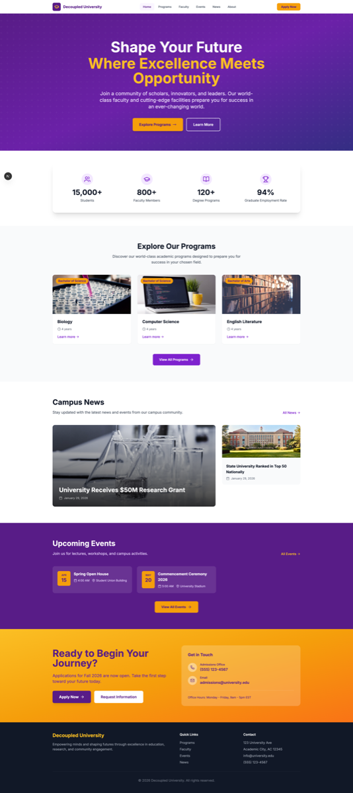

# Decoupled Senior Care

A senior living and care community website starter template for Decoupled Drupal + Next.js. Built for assisted living facilities, memory care communities, skilled nursing centers, and senior care organizations.



## Features

- **Communities** - Showcase senior living residences with care levels, amenities, capacity, addresses, and contact details
- **Services** - Display care services including memory care, rehabilitation, home health, and wellness programs with availability details
- **Activities** - Promote resident activities like yoga, art therapy, social events, and garden club with schedules and instructors
- **Staff** - Feature care team members with positions, certifications, education, and department information
- **Modern Design** - Clean, accessible UI optimized for senior care and healthcare content

## Quick Start

### 1. Clone the template

```bash
npx degit nextagencyio/decoupled-senior-care my-senior-care
cd my-senior-care
npm install
```

### 2. Run interactive setup

```bash
npm run setup
```

This interactive script will:
- Authenticate with Decoupled.io (opens browser)
- Create a new Drupal space
- Wait for provisioning (~90 seconds)
- Configure your `.env.local` file
- Import sample content

### 3. Start development

```bash
npm run dev
```

Visit [http://localhost:3000](http://localhost:3000)

---

## Manual Setup

If you prefer to run each step manually:

<details>
<summary>Click to expand manual setup steps</summary>

### Authenticate with Decoupled.io

```bash
npx decoupled-cli@latest auth login
```

### Create a Drupal space

```bash
npx decoupled-cli@latest spaces create "My Senior Care"
```

Note the space ID returned. Wait ~90 seconds for provisioning.

### Configure environment

```bash
npx decoupled-cli@latest spaces env 1234 --write .env.local
```

### Import content

```bash
npm run setup-content
```

This imports:
- Homepage with hero, stats (500+ residents, 200+ staff, 25+ years, 98% satisfaction), and tour scheduling CTA
- 4 communities: Sunrise Gardens Independent Living, Maple Court Assisted Living, Willow Brook Memory Care, Oakwood Skilled Nursing & Rehabilitation
- 4 services: Memory Care, Rehabilitation Services, Home Health Services, Wellness Programs
- 4 activities: Yoga for Seniors, Art Therapy, Social Hours & Community Events, Garden Club
- 4 staff members: Dr. Patricia Thompson (Medical Director), Maria Rodriguez (Director of Nursing), James Williams (Executive Director), Lisa Chen (Lead Occupational Therapist)
- 2 static pages: About Golden Horizons, Contact Us

</details>

## Content Types

### Community
- **care_level**: Level taxonomy (Independent Living, Assisted Living, Memory Care, Skilled Nursing, Respite Care)
- **address**: Community street address
- **phone**: Community phone number
- **capacity**: Number of residents (e.g., "120 residents")
- **amenities**: List of key amenities offered
- **image**: Community featured image

### Service
- **service_category**: Category taxonomy (Healthcare, Therapy & Rehabilitation, Wellness, Personal Care, Home Health)
- **availability**: When the service is available (e.g., "24/7", "Monday through Saturday")
- **image**: Service image

### Activity
- **activity_type**: Type taxonomy (Fitness & Exercise, Arts & Crafts, Social & Community, Educational, Outdoor & Nature)
- **schedule**: When the activity takes place
- **location**: Where the activity is held
- **instructor**: Activity instructor name and credentials
- **image**: Activity image

### Staff Member
- **position**: Job title (e.g., "Medical Director", "Director of Nursing")
- **department**: Department taxonomy (Nursing, Administration, Activities & Recreation, Dining Services, Rehabilitation)
- **email**: Staff email address
- **phone**: Staff phone number
- **photo**: Staff headshot
- **certifications**: Professional certifications list
- **education**: Education credentials (HTML formatted)

### Homepage
- **hero_title**: Main headline (e.g., "Where Every Day Feels Like Home")
- **hero_subtitle**: Secondary tagline
- **hero_description**: Welcome message
- **stats_items**: Key statistics (residents, staff, years, satisfaction)
- **featured_communities_title**: Section heading for communities
- **cta_title / cta_description**: Tour scheduling call-to-action block

### Basic Page
- General-purpose static content pages (About, Contact, etc.)

## Customization

### Colors & Branding
Edit `tailwind.config.js` to customize colors, fonts, and spacing.

### Content Structure
Modify `data/senior-care-content.json` to add or change content types and sample content.

### Components
React components are in `app/components/`. Update them to match your design needs.

## Demo Mode

Demo mode allows you to showcase the application without connecting to a Drupal backend.

### Enable Demo Mode

```bash
NEXT_PUBLIC_DEMO_MODE=true
```

### Removing Demo Mode

1. Delete `lib/demo-mode.ts`
2. Delete `data/mock/` directory
3. Delete `app/components/DemoModeBanner.tsx`
4. Remove `DemoModeBanner` from `app/layout.tsx`
5. Remove demo mode checks from `app/api/graphql/route.ts`

## Deployment

### Vercel (Recommended)
[](https://vercel.com/new/clone?repository-url=https://github.com/nextagencyio/decoupled-senior-care)

### Other Platforms
Works with any Node.js hosting platform that supports Next.js.

## Documentation

- [Decoupled.io Docs](https://www.decoupled.io/docs)
- [Next.js Documentation](https://nextjs.org/docs)
- [Drupal GraphQL](https://www.decoupled.io/docs/graphql)

## License

MIT
